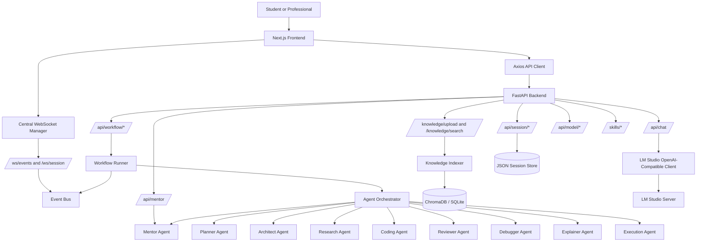

# Student AI Platform

An AI-powered learning, career, project-building, and mentoring workspace for students and early-career professionals.


---

## What Is Student AI Platform?

Student AI Platform is a local-first AI operating workspace that helps students and professionals learn faster, build portfolio projects, plan careers, improve resumes, prepare for interviews, organize knowledge, and coordinate multi-agent workflows.

It combines a Next.js product interface with a FastAPI backend, LM Studio-compatible local model calls, RAG-style document indexing, persistent session memory, WebSocket event updates, and specialized agents for planning, architecture, coding, review, debugging, execution, and mentoring.

The project is built for people who want more than a chatbot:

- Students planning an AI, software, or data career.
- Developers building resume-worthy projects.
- Learners who want explanations, study plans, and interview practice.
- Builders experimenting with local LLMs and multi-agent orchestration.
- Engineers studying how a full-stack AI product can connect frontend UX, backend APIs, agents, memory, workflows, and retrieval.

## Problems It Solves

- Turning vague goals into concrete learning roadmaps.
- Converting project ideas into architecture, files, run instructions, and downloadable source code.
- Improving resumes with ATS-oriented feedback and stronger bullet patterns.
- Uploading learning documents and searching indexed knowledge.
- Keeping chat/session state across app reloads.
- Running staged AI workflows with live agent activity updates.
- Integrating with a local OpenAI-compatible model server instead of relying on a hosted API.

---

## Screenshots

Image files are intentionally referenced but not included in this repository yet.

| Home | Chat | Project Builder |
| --- | --- | --- |
|  |  |  |

| Workflow Studio | Knowledge Base |
| --- | --- |
|  |  |

---

## Features

The following capabilities are verified from the codebase.

### AI Chat

- ChatGPT-style chat workspace in `frontend/components/chat/ChatWorkspace.tsx`.
- Calls `POST /api/chat`.
- Supports markdown rendering, GitHub-flavored markdown, syntax highlighting, code copy, retry, local chat persistence, backend session reconciliation, file attachment for text-like files, loading states, and fallback messaging when the backend is unavailable.
- Backend chat service calls the LM Studio-compatible model client and emits stream-compatible events through the event bus.

### Career Roadmap Generator

- Interactive roadmap page in `frontend/components/student/StudentPages.tsx`.
- Collects goal, skills, timeline, level, and interests.
- Uses the mentor/chat backend path through `api.sendMentorMessage`.
- Renders phases, required skills, certifications, project ideas, and interview preparation.
- Includes local fallback roadmap formatting for unavailable backend responses.

### AI Project Builder

- Conversational project builder in `frontend/components/projects/AIProjectBuilder.tsx`.
- Uses a requirement-gathering flow and specialist panels for requirement, architecture, frontend, backend, debug, and mentor stages.
- Generates a project file explorer, source files, README, API route, run guide, architecture notes, debug analysis, and ZIP download.
- Can accept modification requests and user logs for debugging guidance.
- Triggers backend workflow execution through `/api/workflow/execute` when available.

### Resume Builder

- Interactive resume page in `frontend/components/student/StudentPages.tsx`.
- Accepts resume/profile text, target role, and keywords.
- Calls skill detection through `/skills/detect` or `/api/skills/detect`.
- Produces ATS-oriented suggestions, missing keyword guidance, improved bullet patterns, skill extraction, and improvement notes.
- Includes a local fallback analysis path when the backend cannot respond.

### Knowledge Base

- Upload/search UI in `frontend/components/student/StudentPages.tsx`.
- Supports drag-and-drop and click-to-upload for `.pdf`, `.txt`, and `.md`.
- Calls `POST /knowledge/upload` with multipart form data.
- Calls knowledge search through `GET /knowledge/search` or `/api/knowledge/search`.
- Backend stores uploads under `data/uploads` and indexes with `KnowledgeIndexer`.
- RAG dependencies include ChromaDB, sentence-transformers, pypdf, and tiktoken.

### AI Mentor

- Mentor page and chat flow in `frontend/components/student/StudentPages.tsx`.
- Calls `POST /api/mentor`.
- Backend `MentorAgent` builds structured prompts, uses session history, requests educational JSON sections, and can explain concepts or code.
- Designed around simple, technical, why, analogy, best practices, common mistakes, and learning point sections.

### Progress Tracker

- Student progress tracker in `frontend/components/student/StudentPages.tsx`.
- Tracks daily learning tasks, completion state, estimated minutes, priority, weekly progress, skill areas, roadmap progress, achievements, and motivational messages.
- Persists task state in browser `localStorage`.

### Workflow Studio

- Workflow builder in `frontend/components/workflow/WorkflowBuilder.tsx`.
- Calls:
  - `GET /api/workflow/templates`
  - `POST /api/workflow/execute`
  - `GET /api/workflow/status/{workflow_id}`
  - `POST /api/workflow/status/{workflow_id}/node/{node_id}/retry`
- Includes workflow templates for career roadmap, resume review, project builder, interview prep, knowledge summary, and debugging.
- Shows agent steps, progress, final result, retry controls, save/export, live logs, and an agent activity panel.
- Uses WebSocket updates when connected and polling fallback otherwise.

### Multi-Agent Orchestration

- Backend orchestrator in `backend/workflows/agent_orchestrator.py`.
- Coordinates:
  - PlannerAgent
  - ArchitectAgent
  - ResearchAgent
  - CodingAgent
  - ReviewerAgent
  - DebuggerAgent
  - ExplainerAgent
  - ExecutionAgent
  - MentorAgent
- Stores plans, generated code, explanations, debug context, review output, and workflow state in session memory.

### Local LLM Integration

- LM Studio/OpenAI-compatible client in `backend/local_ai/llm_client.py`.
- Defaults:
  - `MODEL_PROVIDER=lmstudio`
  - `MODEL_NAME=qwen2.5-coder-7b-instruct`
  - `OPENAI_BASE_URL=http://127.0.0.1:1234/v1`
  - `OPENAI_API_KEY=lm-studio`
  - `AI_REQUEST_TIMEOUT=120`
- Supports model status, model test, model listing, and chat completions.

### WebSocket Live Updates

- WebSocket routes in `backend/api/ws_routes.py`.
- Supported sockets:
  - `/ws/events`
  - `/ws/session/{session_id}`
  - `/ws/research`
- Frontend central realtime manager in `frontend/services/realtime.ts`.
- Global bridge in `frontend/components/RealtimeBridge.tsx`.
- Store updates handled in `frontend/lib/store.ts`.
- Supports reconnect, heartbeat, subscriber cleanup, and event-to-store dispatch.

### Session Persistence

- JSON-backed persistent memory in `backend/memory/persistent_memory.py`.
- Session endpoints in `backend/api/routers/session.py`.
- Stores messages, streamed chunks, events, workflow history, token usage, metrics, and agent logs under `backend/storage/sessions`.
- Frontend chat also mirrors state to `localStorage`.

### Skill Engine

- Skill discovery and activation routes in `backend/api/skills_routes.py`.
- Supports listing skills, detecting relevant skills from text, injecting skill instructions, listing registered tools, explaining skill selection, and activating skills.
- Skill catalog folders exist under `skills/`, `backend/skills/`, and `backend/skills_catalog/`.

---

## Architecture



---

## Repository Structure

```text
student-ai-platform/
  backend/
    app.py                    # FastAPI app, CORS, lifespan, routers, websocket broadcaster
    api/
      routers/                # /api chat, mentor, workflow, model, session, agents, projects
      services/               # chat, mentor, model, projects, workflow services
      ws_routes.py            # websocket connection manager and broadcasters
      knowledge_routes.py     # document upload and search endpoints
      skills_routes.py        # skill discovery, detection, activation, tool listing
    agents/                   # planner, architect, coding, reviewer, debugger, mentor, etc.
    workflows/                # agent orchestrator and DAG execution
    local_ai/                 # LM Studio/OpenAI-compatible LLM client
    rag/                      # chunking, embeddings, vector store, retrieval utilities
    knowledge_base/           # knowledge indexing
    memory/                   # session and persistent memory
    storage/sessions/         # local JSON session data
    tests/                    # pytest tests
    requirements.txt

  frontend/
    app/                      # Next.js app routes
    components/
      chat/                   # AI chat workspace
      projects/               # AI project builder
      workflow/               # workflow studio
      student/                # roadmap, resume, mentor, knowledge, progress pages
      layout/                 # app shell and navigation
      ui/                     # shared UI primitives
    hooks/                    # realtime hooks
    lib/                      # API client, store, types, endpoints
    services/                 # websocket realtime managers
    e2e/                      # Playwright smoke tests
    package.json

  skills/                     # top-level skill examples
  scripts/                    # websocket and API test utilities
```

---

## Tech Stack

### Frontend

- Next.js 14 App Router
- React 18
- TypeScript
- Tailwind CSS 4
- Framer Motion
- Zustand
- Axios
- React Markdown, Remark GFM, Rehype Highlight
- React Flow
- Recharts
- next-themes
- Playwright

### Backend

- Python
- FastAPI
- Uvicorn
- Pydantic
- WebSockets
- httpx through the local LLM client
- python-dotenv
- python-multipart
- ChromaDB
- sentence-transformers
- pypdf
- tiktoken
- Redis support for optional workflow queue persistence
- pytest

### Local AI Runtime

- LM Studio or any OpenAI-compatible server exposing:
  - `GET /v1/models`
  - `POST /v1/chat/completions`

---

## Requirements

- Python 3.10 or newer recommended.
- Node.js compatible with Next.js 14.
- npm.
- LM Studio running locally for real AI responses.
- A model loaded in LM Studio. The current default is `qwen2.5-coder-7b-instruct`.

---

## Quick Start

### 1. Clone the repository

```bash
git clone <your-repo-url>
cd student-ai-platform
```

### 2. Start LM Studio

In LM Studio:

1. Load `qwen2.5-coder-7b-instruct` or update `MODEL_NAME` to match your loaded model.
2. Start the local server.
3. Confirm the OpenAI-compatible base URL is:

```text
http://127.0.0.1:1234/v1
```

### 3. Configure the backend

Create `backend/.env`:

```env
MODEL_PROVIDER=lmstudio
MODEL_NAME=qwen2.5-coder-7b-instruct
OPENAI_BASE_URL=http://127.0.0.1:1234/v1
OPENAI_API_KEY=lm-studio
AI_REQUEST_TIMEOUT=120
CORS_ORIGINS=http://localhost:3000,http://127.0.0.1:3000
```

`REDIS_URL` is optional. If omitted, workflows run with the local in-process queue and JSON session persistence.

### 4. Install backend dependencies

```bash
cd backend
python -m venv .venv
.venv\Scripts\activate
pip install -r requirements.txt
```

On macOS/Linux:

```bash
cd backend
python -m venv .venv
source .venv/bin/activate
pip install -r requirements.txt
```

### 5. Run the backend

```bash
python -m uvicorn app:app --host 127.0.0.1 --port 8000 --reload
```

Backend docs are available at:

```text
http://127.0.0.1:8000/docs
```

### 6. Configure the frontend

Create `frontend/.env.local`:

```env
NEXT_PUBLIC_API_URL=http://127.0.0.1:8000
NEXT_PUBLIC_API_BASE_URL=http://127.0.0.1:8000
NEXT_PUBLIC_WS_URL=ws://127.0.0.1:8000
NEXT_PUBLIC_API_WS_URL=ws://127.0.0.1:8000
```

The same values are documented in `frontend/.env.example`.

### 7. Install frontend dependencies

```bash
cd frontend
npm install
```

### 8. Run the frontend

```bash
npm run dev
```

Open:

```text
http://localhost:3000
```

---

## Development Commands

### Frontend

```bash
cd frontend
npm run dev       # Start Next.js dev server on port 3000
npm run build     # Clean and create production build
npm run start     # Start production server
npm run lint      # Run Next lint command
npm run test:e2e  # Run Playwright tests
```

### Backend

```bash
cd backend
python -m uvicorn app:app --host 127.0.0.1 --port 8000 --reload
pytest -q
```

---

## API Overview

### Core

| Method | Path | Purpose |
| --- | --- | --- |
| `GET` | `/health` | Basic backend health check |
| `GET` | `/api/health/full` | Backend service diagnostics |
| `POST` | `/api/chat` | AI chat request |
| `POST` | `/api/mentor` | Mentor response |
| `GET` | `/api/model/status` | LM Studio/model status |
| `GET` | `/api/model/test` | Tiny model test request |
| `GET` | `/api/model/metrics` | Model metrics compatibility response |

### Knowledge

| Method | Path | Purpose |
| --- | --- | --- |
| `POST` | `/knowledge/upload` | Upload and index a document |
| `GET` | `/knowledge/search` | Search indexed knowledge |

### Workflows

| Method | Path | Purpose |
| --- | --- | --- |
| `GET` | `/api/workflow` | Default workflow graph |
| `GET` | `/api/workflow/templates` | Workflow template catalog |
| `POST` | `/api/workflow/execute` | Start a workflow |
| `GET` | `/api/workflow/status/{workflow_id}` | Read workflow status |
| `POST` | `/api/workflow/status/{workflow_id}/node/{node_id}/retry` | Retry a workflow step |

### Sessions

| Method | Path | Purpose |
| --- | --- | --- |
| `GET` | `/api/session/{session_id}` | Read persisted session data |
| `GET` | `/api/session/{session_id}/timeline` | Read session timeline |
| `GET` | `/api/session/{session_id}/metrics` | Read session metrics |
| `GET` | `/api/session/{session_id}/workflow` | Read workflow history |
| `GET` | `/api/session/{session_id}/replay` | Replay persisted events/messages |

### Skills

| Method | Path | Purpose |
| --- | --- | --- |
| `GET` | `/skills/list` | Discover available skills |
| `POST` | `/skills/detect` | Detect relevant skills from text |
| `POST` | `/skills/inject` | Inject skill instructions into messages |
| `POST` | `/skills/tools/list` | List registered tools |
| `POST` | `/skills/explain` | Explain skill/tool selection |
| `POST` | `/skills/activate` | Activate a skill |

### WebSockets

| Path | Purpose |
| --- | --- |
| `/ws/events` | Global event stream for workflow, agent, heartbeat, model, and log events |
| `/ws/session/{session_id}` | Session-scoped event replay and live updates |
| `/ws/research` | Research websocket test/ack channel |

---

## Environment Variables

### Backend

| Variable | Default | Description |
| --- | --- | --- |
| `MODEL_PROVIDER` | `lmstudio` | Current model provider label |
| `MODEL_NAME` | `qwen2.5-coder-7b-instruct` | Model identifier sent to LM Studio |
| `OPENAI_BASE_URL` | `http://127.0.0.1:1234/v1` | OpenAI-compatible base URL |
| `OPENAI_API_KEY` | `lm-studio` | Bearer token for the model server |
| `AI_REQUEST_TIMEOUT` | `120` | AI request timeout in seconds |
| `TEMPERATURE` | `0.7` | LLM sampling temperature |
| `MAX_TOKENS` | `512` | Default max tokens |
| `CORS_ORIGINS` | `http://localhost:3000,http://127.0.0.1:3000` | Allowed frontend origins |
| `REDIS_URL` | empty | Optional Redis URL for workflow queue persistence |

### Frontend

| Variable | Default | Description |
| --- | --- | --- |
| `NEXT_PUBLIC_API_URL` | `http://127.0.0.1:8000` | Backend HTTP base URL |
| `NEXT_PUBLIC_API_BASE_URL` | `http://127.0.0.1:8000` | Alternate backend base URL |
| `NEXT_PUBLIC_WS_URL` | derived from API URL | Backend WebSocket base URL |
| `NEXT_PUBLIC_API_WS_URL` | derived from API URL | Alternate WebSocket base URL |
| `NEXT_PUBLIC_WS_BASE_URL` | derived from API URL | Alternate WebSocket base URL |

---

## Verified User Flows

### AI Chat

1. Start LM Studio and backend.
2. Open `/chat`.
3. Send a prompt.
4. The frontend calls `/api/chat`.
5. The backend calls LM Studio and stores session data.

### Knowledge Upload

1. Open `/knowledge`.
2. Drag or select a `.pdf`, `.txt`, or `.md` file.
3. The frontend sends multipart form data to `/knowledge/upload`.
4. The backend saves the file and indexes it.
5. Search from the same page.

### Workflow Studio

1. Open `/workflows`.
2. Select a workflow template.
3. Enter a student goal.
4. Run the workflow.
5. Watch agent steps, activity logs, progress, and final result.

### Project Builder

1. Open `/projects`.
2. Describe the project to build.
3. Review generated architecture, file explorer, source files, README, run guide, and agent outputs.
4. Download the generated ZIP.

---

## Testing

Backend tests are under `backend/tests` and include:

- Workflow orchestrator test with mock LLM.
- Session API tests.
- Persistent memory tests.
- Event bus persistence tests.
- Mentor agent tests.

Run:

```bash
cd backend
pytest -q
```

Frontend Playwright tests are under `frontend/e2e`. Review and update assertions if the UI copy changes.

```bash
cd frontend
npm run test:e2e
```

Build verification:

```bash
cd frontend
npm run build
```

---

## Notes on Local-First AI

This project is designed to run against LM Studio or a compatible local model server. The backend uses OpenAI-style chat completions but does not require OpenAI-hosted models by default.

Expected LM Studio endpoints:

```text
GET  http://127.0.0.1:1234/v1/models
POST http://127.0.0.1:1234/v1/chat/completions
```

The configured backend model status endpoints make it easy to verify local model connectivity:

```text
GET http://127.0.0.1:8000/api/model/status
GET http://127.0.0.1:8000/api/model/test
```

---

## Security and Data Notes

- `.env` files are ignored by `.gitignore`.
- Uploaded files are written locally under `data/uploads`.
- Sessions are stored locally as JSON under `backend/storage/sessions`.
- ChromaDB data is local to the backend workspace.
- The project includes local file/tool capabilities in the skill engine; use them carefully and review tool routes before exposing the backend beyond a trusted local environment.

---

## Current Limitations

- No root license file is present, so the repository license is currently not specified.
- Authentication and multi-user account management are not implemented.
- Redis is optional and not required for the default local workflow path.
- Some frontend fallbacks generate local guidance when the backend or model is unavailable.
- Playwright smoke copy may need updates after UI text changes.

---

## Contributing

This repository is structured to be approachable:

1. Keep frontend changes inside the relevant app route or component module.
2. Keep backend routes thin and put behavior in `api/services` or agent/workflow modules.
3. Prefer local-first behavior and clear error messages.
4. Add tests for backend services, persistence, workflows, and API routes.
5. Keep README claims aligned with actual code.

---

## License

No license file is currently present in the repository. Add a `LICENSE` file before publishing or accepting external contributions.
